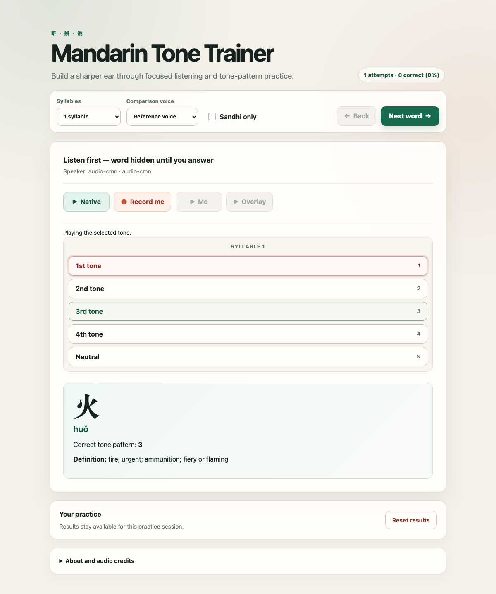

<div align="center">
  
  <h1>Mandarin Tone Trainer</h1>
  <p><strong>Hear the word. Identify the tones. Compare your voice.</strong></p>
  <p>An offline Mandarin listening trainer for HSK 1–9 vocabulary.</p>
  <p>
    <a href="#quickstart">Quickstart</a> ·
    <a href="docs/android.md">Android guide</a> ·
    <a href="docs/audio-maintenance.md">Audio guide</a>
  </p>
</div>

---

## Learn tones from real words

Mandarin Tone Trainer hides the written word and plays a native recording.
You identify the tone of each syllable before seeing the word, pinyin,
definition, and expected spoken-tone pattern.

<p align="center">
  
</p>

### Listen without visual hints

**Native** playback uses a recording of the complete word. The answer stays
hidden until you choose a tone for every syllable.

### Compare tones directly

Every tone button plays an isolated syllable—not the original word. Switch
**Comparison voice** to hear either a clear reference corpus or human
`audio-cmn` recordings. Reviewed fallbacks replace clips known to be
duplicated, mislabeled, or unclear.

### Practice your pronunciation

Use **Record me** to capture your voice locally. Play it on its own or use
**Overlay** to compare it with the native recording. Microphone permission is
only required for recording.

## Quickstart

You need Git, Python 3.10 or newer, and about 1 GiB of free disk space.

```bash
git clone https://github.com/hanshanley/mandarin-tone-trainer.git
cd mandarin-tone-trainer
python3 scripts/bootstrap.py
python3 scripts/serve.py
```

Open **<http://localhost:8000/app/>**.

The bootstrap is the only setup command required on a fresh clone. It installs
pinned local versions of Node.js, npm, JDK 21, and FFmpeg; downloads the audio
collections; builds the offline assets; and validates the finished setup.
Downloads are resumable.

After setup, new terminals can use `node`, `npm`, `npx`, `java`, `keytool`, and
`ffmpeg` normally. To activate them immediately in the current zsh session:

```bash
source ~/.zprofile
```

To run the trainer again later:

```bash
cd mandarin-tone-trainer
python3 scripts/serve.py
```

## Tone-aware grading

The trainer distinguishes dictionary tones from tones heard in connected
speech. For example, 你好 has the lexical pattern `3-3`, while its usual spoken
realization is approximately `2-3`.

The data models common third-tone sandhi, 不 and 一 changes, and neutral-tone
reductions. Recording-specific labels take priority when the speaker's actual
pronunciation differs from the default prediction.

## Offline Android app

The Android build packages the application, vocabulary, and every reachable
audio file into a single offline APK.

After the quickstart, install Android SDK Platform 36, Platform Tools, and
Build Tools 35, then run:

```bash
npm run android:debug
```

The APK is created at:

```text
android/app/build/outputs/apk/debug/app-debug.apk
```

See the [Android guide](docs/android.md) for SDK configuration, release
signing, installation, and updates.

## Audio and vocabulary

The reviewed dataset contains:

- **11,092** HSK vocabulary entries
- **8,596** isolated native word recordings
- **1,707** human tone-specific syllables
- **1,622** public-domain reference syllables

Large generated assets are intentionally excluded from Git. The bootstrap
recreates them from pinned upstream revisions.

Known audio defects and approved fallbacks live in
[`data/correction_audio_quality.json`](data/correction_audio_quality.json).
Audits cover file integrity, duplicate payloads, pitch contours, runtime
selection, and bundle completeness. Ambiguous pitch results are left for
listening review rather than rejected automatically.

## Development

```bash
npm test                  # run the test suite
npm run verify:setup      # validate downloaded and generated assets
npm run build:mobile      # rebuild the offline web bundle
npm run android:debug     # build the Android debug APK
```

Application code lives in `app/`, reviewed runtime data in `data/`, tooling in
`scripts/`, tests in `tests/`, and the Capacitor project in `android/`.

Corpus updates, local imports, and individual audit tools are documented in
the [audio maintenance guide](docs/audio-maintenance.md).

## FAQ

<details>
<summary><strong>Why are Native and the tone buttons different recordings?</strong></summary>

Native playback trains recognition of a complete word in natural speech. Tone
buttons isolate one syllable and one tone for comparison. Reusing a full word
as an isolated-tone example would make the correction misleading.

</details>

<details>
<summary><strong>Why does the app sometimes switch audio sources?</strong></summary>

Some upstream recordings are duplicated, mislabeled, or acoustically unclear.
The quality policy selects a reviewed clip from the independent corpus when
the preferred recording is quarantined.

</details>

<details>
<summary><strong>What if npm, keytool, or FFmpeg is not found?</strong></summary>

Rerun `python3 scripts/bootstrap.py`, then open a new terminal. In the current
zsh session, run `source ~/.zprofile`.

</details>

<details>
<summary><strong>Where are the downloaded audio files?</strong></summary>

Generated audio is stored under `audio/`. The offline mobile bundle is written
to `www/`. Both directories are ignored by Git and can be recreated by the
bootstrap.

</details>

## Sources and licenses

Definitions come from
[CC-CEDICT](https://www.mdbg.net/chinese/dictionary?page=cedict), maintained by
MDBG and distributed under
[CC BY-SA 4.0](https://creativecommons.org/licenses/by-sa/4.0/).

Native word and human syllable recordings come from `audio-cmn` under its
published CC BY-SA terms. Reference syllables come from
[`mp3-chinese-pinyin-sound`](https://github.com/davinfifield/mp3-chinese-pinyin-sound)
under the Unlicense.
