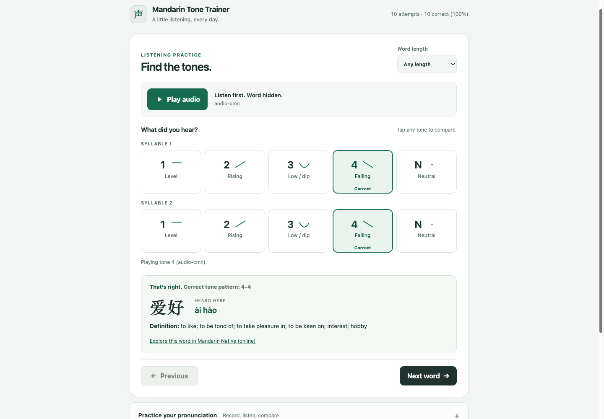

<div align="center">
  
  <h1>Mandarin Tone Trainer</h1>
  <p><strong>Hear the word. Identify the tones. Compare your voice.</strong></p>
  <p>Offline Mandarin listening practice for the browser and Android.</p>
  <p>
    <a href="#quickstart">Quickstart</a> ·
    <a href="#using-the-trainer">How to practice</a> ·
    <a href="docs/android.md">Android guide</a> ·
    <a href="docs/audio-maintenance.md">Audio guide</a>
  </p>
</div>

Practice with HSK 1–9 vocabulary and publisher pronunciation drills. Listen
without seeing the answer, identify each syllable's tone, then replay examples
or compare your own recording.

<p align="center">
  
</p>

## Quickstart

You need Git, Python 3.10 or newer, and internet access for the initial downloads.

```bash
git clone https://github.com/hanshanley/mandarin-tone-trainer.git
cd mandarin-tone-trainer
python3 -m pip install -r requirements.txt
python3 scripts/bootstrap.py
python3 scripts/serve.py
```

Open **<http://localhost:8000/app/>**.

The bootstrap sets up Node.js, npm, JDK 21, and FFmpeg as needed, restores the
pinned audio and practice data, builds the offline assets, and checks the setup.
Downloads are resumable. Once setup is complete, run `python3 scripts/serve.py`
from the project directory to use the trainer again.

If a newly installed command is not available in your terminal, open a new
terminal or run `source ~/.zprofile` in the current zsh session.

## Using the trainer

1. **Listen.** Choose a word length and press **Play audio**. The word stays
   hidden until you answer.
2. **Choose the tones.** Select one tone per syllable. Feedback reveals the
   word, pinyin, meaning when available, and expected spoken tones.
3. **Compare and repeat.** Tone buttons remain playable after an incorrect
   answer. Use **Previous** or **Next word** to move through practice.

**Practice settings** separates two choices: **Word recordings** selects the
source of the complete-word audio; **Comparison voice** chooses a preferred
voice for the tone buttons. Missing references fall back to another eligible
source. You can use all sources or focus on the original library, Mandarin
Native, Sinosplice, or Glossika when available in your build.

**Practice your pronunciation** lets you record your voice locally.
**Play mine** replays it; **Overlay** plays it alongside the native recording.
Only recording requires microphone permission. Results stay in the current
session.

### Glossika examples and book lessons

Open **Glossika book lessons** to choose a full lesson or an individual example,
with the original book page alongside it. **Practice this example** sends an
eligible item to the main quiz; examples with unresolved mappings or tone
changes remain ungraded.

Local-use builds include **117 complete lessons** and **4,526 individually
playable examples**. Together with the other sources, the quiz contains **5,465
catalog entries**. These are different measures—not counts of unique audio
files or distinct words. The [coverage report](data/glossika_example_coverage.json)
separates source entries, playable examples, quiz items, and unresolved mappings.

## Audio and grading

Every quiz item has playable comparisons for **tones 1–4 on every syllable**.
The app verifies the selected recordings before showing the choices. Neutral
tone comparisons use whole-word context, not an invented isolated fifth tone.
**Heard here** shows the recording's spoken pattern; the dictionary form is
shown separately when sandhi or another supported pronunciation differs.

The original audio sources use acoustic or listening assessments. Glossika
uses a separate publisher-label and complete-utterance mapping process.
Uncertain mappings are not assigned guessed answers, and source-label
confidence is not presented as independent pronunciation certification.

Playback preserves complete words and drill utterances rather than stitching
syllables or cutting words from sentences. Original source files are unchanged;
playback headroom protects against excessive peaks. These checks reduce errors
but **do not guarantee 100% pronunciation accuracy**.

See the [audio maintenance guide](docs/audio-maintenance.md),
[pronunciation review](data/quiz_pronunciation_review.json), and
[playback audit](docs/playback-integrity.json) for policies, evidence, and limits.

## Android

After the quickstart, configure the Android SDK using the
[Android guide](docs/android.md), then build:

```bash
python3 scripts/bootstrap.py --verify-only
npm run android:debug
```

The APK is written to:

```text
android/app/build/outputs/apk/debug/app-debug.apk
```

To install or update over USB without clearing app data:

```bash
adb install -r android/app/build/outputs/apk/debug/app-debug.apk
```

The debug APK is a **personal/local-use build, not for redistribution**.
Default web-bundle and release commands exclude local-only media and private
publisher vocabulary. The Android guide covers signing, release builds, and
device updates.

## Development

| Command | Purpose |
|---|---|
| `npm test` | Run the test suite |
| `npm run verify:setup` | Check the existing setup and run tests |
| `npm run build:mobile` | Build the offline web bundle without local-only content |
| `npm run build:mobile:local` | Build the personal-use bundle with imported content |
| `npm run android:debug` | Build the local-use Android APK |
| `npm run assets:icons` | Regenerate launcher icons, splash screens, and the web logo |
| `npm run assets:icons:check` | Check generated branding against its SVG source |

Application code is in `app/`, runtime metadata in `data/`, tools in `scripts/`,
tests in `tests/`, and the Capacitor project in `android/`. Downloaded audio
(`audio/`), source archives (`imports/`), the mobile bundle (`www/`), and private
publisher example data are ignored by Git and restored by setup.

The [audio maintenance guide](docs/audio-maintenance.md) covers corpus updates,
imports, and audits. The [pronunciation judge](docs/pronunciation-judge.md) and
[native tone-label validator](docs/native-tone-validator.md) document separate
experimental workflows; they are not blanket filters on normal practice.

## Sources and licenses

| Source | Content | Terms |
|---|---|---|
| [audio-cmn](https://github.com/hugolpz/audio-cmn) | Word and syllable recordings | CC BY-SA |
| [mp3-chinese-pinyin-sound](https://github.com/davinfifield/mp3-chinese-pinyin-sound) | Reference syllables | Unlicense |
| [CC-CEDICT](https://www.mdbg.net/chinese/dictionary?page=cedict), maintained by MDBG | Definitions | [CC BY-SA 4.0](https://creativecommons.org/licenses/by-sa/4.0/) |
| [Mandarin Native](https://mandarin-native.com/#explore) | Direct word recordings | Reuse permission unverified; local-use imports only |
| [John Pasden / Sinosplice.com](https://www.sinosplice.com/learn-chinese/tone-pair-drills) | Tone Pair Drills | [CC BY-NC-SA 2.5](https://creativecommons.org/licenses/by-nc-sa/2.5/); attribution, noncommercial, and ShareAlike terms apply |
| [Michael Campbell / Glossika](https://ai.glossika.com/free-download/glossika-chinese-pronunciation-tones-training) | *Chinese Pronunciation & Tone Training* | Copyright 2018 Glossika. All rights reserved; personal companion use only |

Sinosplice is restricted to local-use builds. Glossika's recordings remain
paired with the original book and pages; its audio, book, and private example
catalog are excluded from redistributable builds. Download availability does
not grant redistribution permission. Source URLs, hashes, and restoration
procedures are documented in the [audio guide](docs/audio-maintenance.md).
